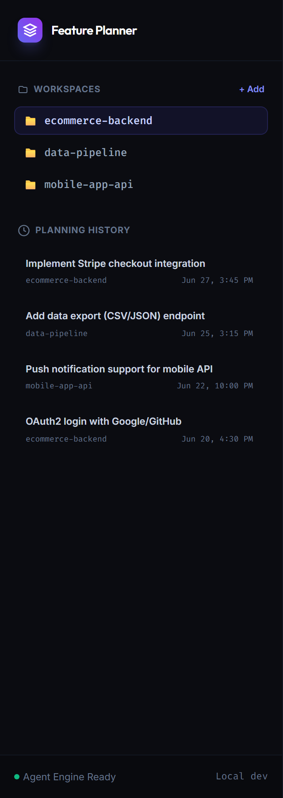
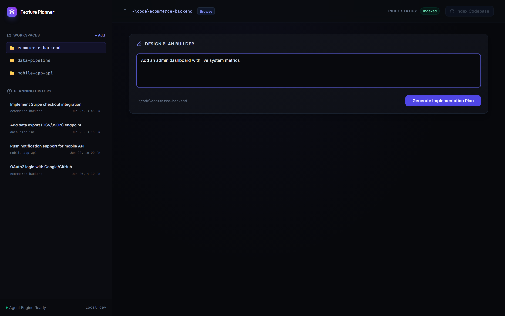
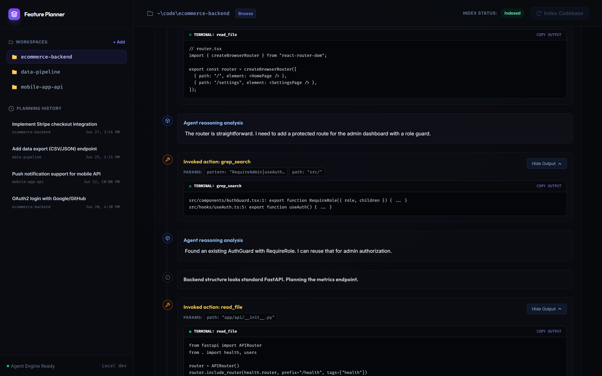
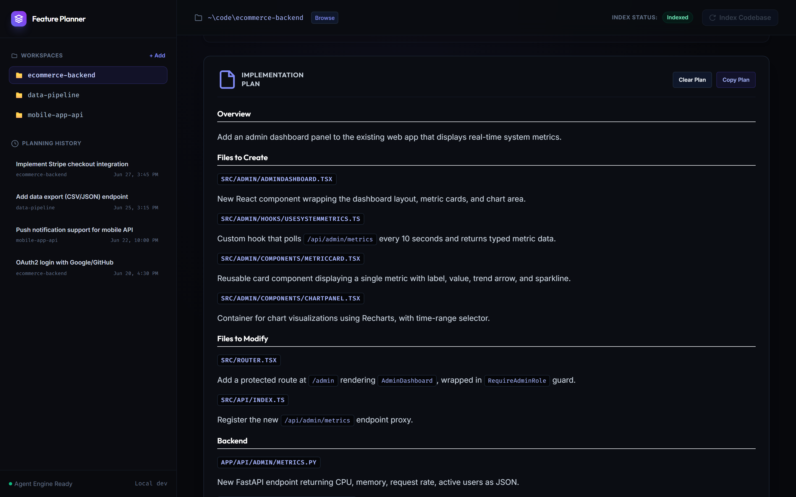

# codebase-feature-planner

> Index any codebase, describe a feature, get a concrete file-by-file implementation plan.

Uses hybrid BM25 + vector search with Reciprocal Rank Fusion for retrieval, and an agentic tool-calling loop to explore the codebase before generating a plan.


| Sidebar with workspaces & history | Feature request prompt |
|---|---|
|  |  |

| Live agent execution logs | Generated implementation plan |
|---|---|
|  |  |

---

## Quick Start

```bash
git clone <repo>
cd codebase-feature-planner

python -m venv .venv
.venv\Scripts\activate        # Windows
# source .venv/bin/activate   # Unix/Mac

pip install -e .
cp .env.example .env          # add GROQ_API_KEY

uvicorn api.main:app --host 0.0.0.0 --port 8420 --reload
```

```bash
cd ui && npm install && npm run dev
```

Open `http://localhost:3000`, select a local codebase directory, index it, then describe a feature.

---

## How It Works

```
┌─────────────────────────────────────────────────────────────┐
│  Next.js UI  (ui/)                                          │
│  /plan/stream → SSE events (thought, tool_call, plan_chunk) │
└──────────────────────────┬──────────────────────────────────┘
                           │ HTTP
┌──────────────────────────▼──────────────────────────────────┐
│  FastAPI  (api/main.py)                                     │
│  /ingest | /plan | /plan/stream | /history | /browse        │
└──────────────────────────┬──────────────────────────────────┘
                           │
┌──────────────────────────▼──────────────────────────────────┐
│  Ingestion  (core/ingest.py)                                │
│  Walk codebase → chunk at semantic boundaries               │
│  → embed (bge-small-en-v1.5) → store in ChromaDB            │
│  → build BM25 index → persist to disk                       │
└──────────────────────────┬──────────────────────────────────┘
                           │
┌──────────────────────────▼──────────────────────────────────┐
│  Retrieval  (core/retrieve.py)                              │
│  query → dense search (ChromaDB) + sparse search (BM25)     │
│  → RRF fusion → top-k chunks injected into LLM context      │
└──────────────────────────┬──────────────────────────────────┘
                           │
┌──────────────────────────▼──────────────────────────────────┐
│  Agent Loop  (core/agent.py)                                │
│  LLM (Groq / Ollama) + tools: tree, read_file, grep, find   │
│  min 3 exploration turns → streaming plan generation        │
└──────────────────────────┬──────────────────────────────────┘
                           │
┌──────────────────────────▼──────────────────────────────────┐
│  History  (core/history.py)                                 │
│  Workspace list & plan metadata persisted as JSON           │
└─────────────────────────────────────────────────────────────┘
```

---

## Stack

| Layer | Tech |
|---|---|
| Frontend | Next.js, Tailwind CSS |
| Backend | FastAPI, Python |
| Embeddings | `BAAI/bge-small-en-v1.5` (local, via sentence-transformers) |
| Vector store | ChromaDB (embedded, no server) |
| Sparse search | BM25 (rank_bm25) |
| Generation | Groq (`gpt-oss-120b`) or Ollama (local) |
| Streaming | Server-Sent Events |

---

## Key Design Decisions

**Hybrid Retrieval**
Queries run through both dense embeddings (`BAAI/bge-small-en-v1.5`) and BM25 sparse retrieval simultaneously. Results are merged via Reciprocal Rank Fusion (`score = Σ 1/(rank + 60)`). This matters for code specifically — pure vector search misses exact identifier matches (`getUserById`, `AUTH_TOKEN`), while pure BM25 misses semantic intent. RRF captures both.

**Semantic Chunking**
Files are chunked at language-aware boundaries (function/class definitions for `.py`, `.js`, `.ts`) rather than fixed character splits. This keeps logically related code together so retrieved chunks are actually useful as context.

**Agent Tool Loop**
The LLM doesn't generate a plan from retrieval results alone. It runs a minimum of 3 exploration turns using tools (`tree`, `read_file`, `grep_search`, `file_search`) to follow imports, inspect related files, and build a complete picture before writing the plan. Fallback strategies handle malformed tool calls without breaking the loop.

**Streaming UI**
The backend emits typed SSE events (`thought`, `chunk`, `tool_call`, `tool_result`, `plan_chunk`). The frontend renders these as a live timeline — you can watch the agent explore the codebase in real time, with expandable tool outputs and a markdown-rendered final plan.

**Output Format**
Plans are structured as: files to modify, files to create, numbered implementation steps (each tied to a specific file and line range), and potential issues. This is intentionally formatted to be pasted directly into OpenCode or Cursor.

---

## Configuration

```env
GROQ_API_KEY=your_key_here

# Optional: use local Ollama instead of Groq
OLLAMA_BASE_URL=http://localhost:11434
OLLAMA_MODEL=qwen2.5:7b
```